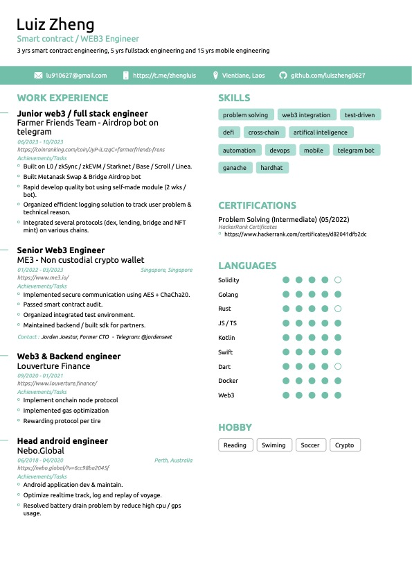

<h1 align='center'>
Hi 👋, I'm <a href="resume/resume.pdf">Luiz Zheng</a> 👨‍💻
</h1>

Ethereum | Polkadot | Solana | CosmosSDK | Rust | Solidty | iOS | Android | Flutter

  &nbsp;&nbsp;
  &nbsp;&nbsp;
  &nbsp;&nbsp;

  

  Your star would be great helpful! <a href='https://stars.github.com/nominate/'>Nominate me to Github Stars ⭐</a>

  📫 How to reach me: <a href='mailto:zl910627@yahoo.com'>zl910627@yahoo.com</a>

